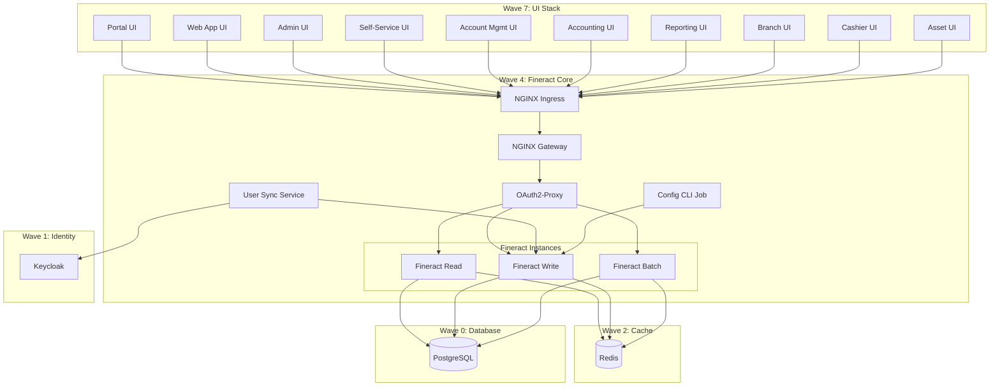

# Design Document: Fineract Deployment Helm Charts

## Overview

This design defines two Helm charts for deploying Apache Fineract on Kubernetes: `fineract-core` (Wave 4) and `fineract-ui-stack` (Wave 7). The charts adapt patterns from the existing `base-app` chart in the workspace and reference structures from `fineract-gitops`, providing a production-ready deployment architecture for the Fineract core banking system.

### Purpose

The Fineract deployment charts enable:
- **Wave 4 (fineract-core)**: Deployment of the core banking engine with read/write/batch instances, API gateway, authentication proxy, and user synchronization
- **Wave 7 (fineract-ui-stack)**: Deployment of 10 frontend applications providing user interfaces for banking operations

### Scope

**In Scope:**
- Helm chart structure and templates for both waves
- Configuration management via values.yaml
- Security architecture (OAuth2-Proxy, Keycloak integration)
- Routing logic (NGINX Gateway)
- Resource management and health monitoring
- Secret management patterns
- Documentation and deployment guides

**Out of Scope:**
- Actual Fineract application code modifications
- Database schema migrations
- Keycloak realm configuration
- CI/CD pipeline definitions
- Monitoring dashboards and alerting rules

### Key Design Decisions

1. **Chart Separation**: Wave 4 and Wave 7 are separate charts to allow independent deployment and lifecycle management
2. **Base Pattern Adaptation**: Leverage existing `base-app` chart patterns for consistency across the platform
3. **Reference-Based Design**: Adapt proven patterns from `fineract-gitops` without modifying the reference
4. **Security-First**: OAuth2-Proxy positioned between gateway and backend services
5. **Configuration Externalization**: All environment-specific values configurable via values.yaml
6. **Secret Management**: Kubernetes Secrets with recommendation for external-secrets-operator in production

## Architecture

### High-Level Architecture



## Component Details

### Wave 4: Fineract Core Components

#### Fineract Instances

| Component | Purpose | Replicas | Mode |
|-----------|---------|----------|------|
| Fineract Read | Query operations | 2+ | FINERACT_MODE_READ_ENABLED=true |
| Fineract Write | Transaction operations | 2+ | FINERACT_MODE_WRITE_ENABLED=true |
| Fineract Batch | Scheduled jobs | 1 | FINERACT_MODE_BATCH_ENABLED=true |

#### Supporting Services

| Component | Purpose | Image |
|-----------|---------|-------|
| NGINX Gateway | Request routing | nginx:1.25-alpine |
| OAuth2-Proxy | Token validation | quay.io/oauth2-proxy/oauth2-proxy:v7.5.1 |
| User Sync | User synchronization | Custom image |
| Config CLI | Bootstrap configuration | Custom image |

### Wave 7: UI Stack Components

| Application | Description | Default Status |
|-------------|-------------|----------------|
| Portal | Main entry point and dashboard | Enabled |
| Web App | Primary banking operations interface | Disabled |
| Admin | Administrative functions | Enabled |
| Self-Service | Customer self-service portal | Disabled |
| Account Management | Account operations | Enabled |
| Accounting | Financial accounting interface | Enabled |
| Reporting | Reports and analytics | Enabled |
| Branch | Branch operations | Enabled |
| Cashier | Teller operations | Enabled |
| Asset | Asset management | Enabled |

## Configuration Strategy

### Values Structure

```yaml
# Global configuration
global:
  domain: example.com
  apiEndpoint: https://api.fineract.example.com
  keycloak:
    url: https://keycloak.example.com
    realm: fineract

# Component-specific configuration
<component>:
  enabled: true/false
  image:
    repository: <image-repo>
    tag: <version>
  resources:
    requests:
      cpu: <value>
      memory: <value>
    limits:
      cpu: <value>
      memory: <value>
  tls:
    enabled: true
    secretName: <secret>
```

### Secret Management

Secrets are managed via Kubernetes Secrets with the following pattern:
- Database credentials: `fineract-db-secret`
- Keycloak credentials: `keycloak-credentials`
- OAuth2 credentials: `oauth2-proxy-secret`
- Fineract API credentials: `fineract-api-secret`

For production, use external-secrets-operator to sync from vaults.

## Routing Logic

### NGINX Gateway Rules

```nginx
# Read operations (GET requests)
GET /* → fineract-read:8080

# Write operations (POST, PUT, DELETE, PATCH)
POST /* → fineract-write:8080
PUT /* → fineract-write:8080
DELETE /* → fineract-write:8080
PATCH /* → fineract-write:8080

# Batch operations
/batch/* → fineract-batch:8080
```

## Security Architecture

1. **TLS Termination**: cert-manager at Ingress level
2. **Authentication**: OAuth2-Proxy validates OIDC tokens from Keycloak
3. **Authorization**: Fineract internal RBAC
4. **Network Policies**: Restrict inter-service communication
5. **Pod Security**: runAsNonRoot, readOnlyRootFilesystem

## Resource Requirements

### Fineract Instances

| Instance | CPU Request | CPU Limit | Memory Request | Memory Limit |
|----------|-------------|-----------|----------------|--------------|
| Read | 500m | 2000m | 1Gi | 4Gi |
| Write | 500m | 2000m | 1Gi | 4Gi |
| Batch | 250m | 1000m | 512Mi | 2Gi |

### UI Applications

| App | CPU Request | CPU Limit | Memory Request | Memory Limit |
|-----|-------------|-----------|----------------|--------------|
| All UI | 50m | 200m | 64Mi | 256Mi |

## Health Checks

All components implement:
- **Liveness Probe**: `/actuator/health` (Fineract) or `/` (UI)
- **Readiness Probe**: `/actuator/health` (Fineract) or `/` (UI)
- **Startup Probe**: For slow-starting components (30 failure threshold)

## Deployment Order

1. Wave 0: PostgreSQL (database)
2. Wave 1: Keycloak (identity)
3. Wave 2: Redis (cache)
4. Wave 4: Fineract Core (this chart)
5. Wave 7: Fineract UI Stack (this chart)
