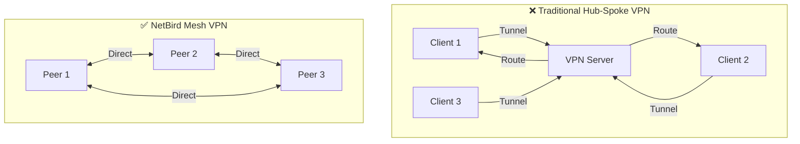
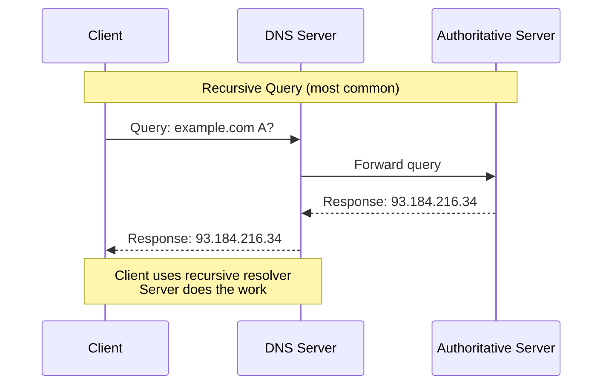
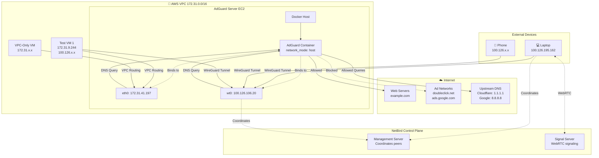
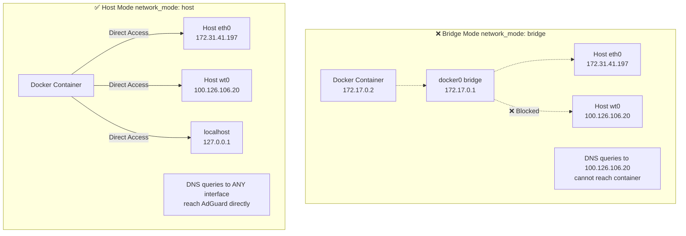
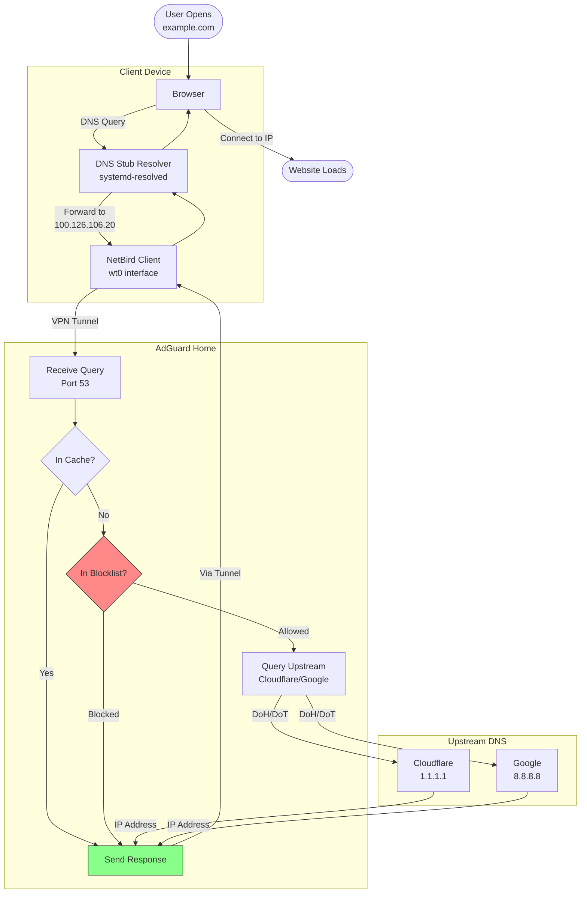
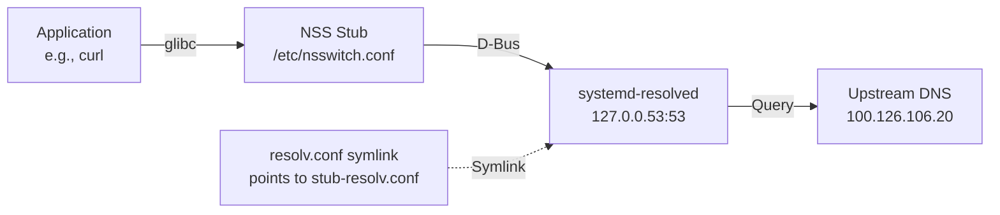
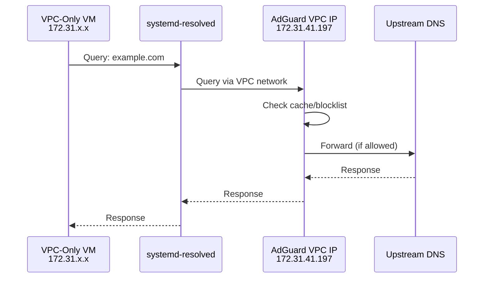
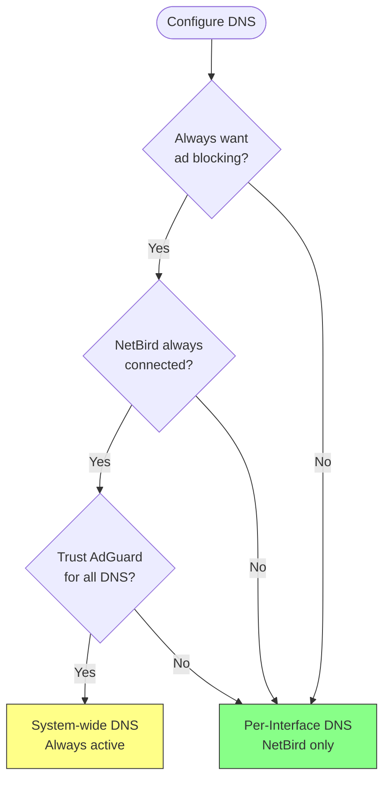
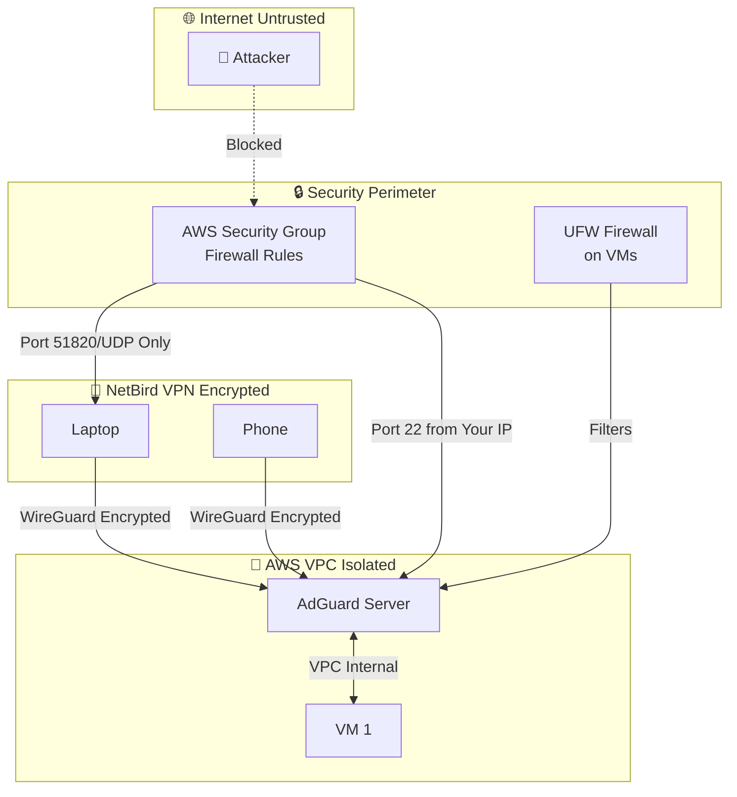

# AdGuard Home + NetBird Integration

## Technical Reference & Deep Dive

**Comprehensive technical documentation for understanding, configuring, and troubleshooting the AdGuard Home and NetBird integration.**

---

> **📋 Document Information**  
> **Type:** Technical Reference  
> **Level:** Advanced  
> **Audience:** System administrators, DevOps engineers, Network engineers  
> **Companion Document:** [Deployment Tutorial](../tutorial/deploying_and_integrating_adguard_with_netbird.md)

---

## Table of Contents

1. [Networking Fundamentals](#networking-fundamentals)
2. [Architecture Deep Dive](#architecture-deep-dive)
3. [DNS Resolution Flow](#dns-resolution-flow)
4. [Security Considerations](#security-considerations)
5. [Performance Optimization](#performance-optimization)
6. [Advanced Configuration](#advanced-configuration)
7. [Troubleshooting Guide](#troubleshooting-guide)
8. [Best Practices](#best-practices)

---

## Networking Fundamentals

> **🎯 Section Overview**  
> This section covers the fundamental networking concepts required to understand the AdGuard + NetBird integration, including IP ranges, VPN mesh architecture, and DNS protocol basics.

### IP Address Ranges

Understanding the different IP ranges is crucial for this setup:

| CIDR Block | Type | Purpose | Example |
|------------|------|---------|---------|
| `172.31.0.0/16` | Private (RFC 1918) | AWS VPC internal network | 172.31.41.197 |
| `100.64.0.0/10` | Shared (RFC 6598) | NetBird VPN mesh network | 100.126.106.20 |
| `10.0.0.0/8` | Private (RFC 1918) | Alternative private networks | 10.0.0.1 |
| `192.168.0.0/16` | Private (RFC 1918) | Home/office networks | 192.168.1.1 |

**Why different ranges?**
- **172.31.0.0/16:** AWS default VPC uses this range. All EC2 instances get an IP from this pool.
- **100.64.0.0/10:** NetBird uses this carrier-grade NAT (CGNAT) range for the VPN overlay network. It doesn't conflict with typical private networks.

### VPN Mesh Networking

NetBird creates a **peer-to-peer mesh network** using WireGuard:



**Advantages of Mesh:**
- **Lower latency:** Direct peer-to-peer connections
- **Higher throughput:** No central bottleneck
- **Better reliability:** No single point of failure
- **NAT traversal:** Built-in hole punching for devices behind NAT

### DNS Protocol Basics

**DNS Query Types:**



**DNS Record Types Used:**
- **A:** IPv4 address mapping (e.g., `google.com` → `142.250.x.x`)
- **AAAA:** IPv6 address mapping
- **CNAME:** Canonical name (alias)
- **PTR:** Reverse DNS lookup
- **MX:** Mail exchange servers

**Transport Protocols:**
- **UDP/53:** Standard DNS (fast, no handshake)
- **TCP/53:** Used for large responses or zone transfers
- **DoH (DNS over HTTPS):** Encrypted DNS via HTTPS (port 443)
- **DoT (DNS over TLS):** Encrypted DNS via TLS (port 853)

---

## Architecture Deep Dive

> **🎯 Section Overview**  
> Detailed breakdown of system components, network topology, Docker networking, and DNS query routing mechanisms.

### Component Topology



### Network Interfaces

**On AdGuard Server:**

```bash
# Show all interfaces
ip addr show

# Output:
# 1: lo: <LOOPBACK,UP,LOWER_UP>
#     inet 127.0.0.1/8 scope host lo
#
# 2: eth0: <BROADCAST,MULTICAST,UP,LOWER_UP>
#     inet 172.31.41.197/20 brd 172.31.47.255 scope global eth0
#
# 3: wt0: <POINTOPOINT,MULTICAST,NOARP,UP,LOWER_UP>
#     inet 100.126.106.20/16 scope global wt0
```

**Interface Roles:**
- **lo (loopback):** Local testing (`127.0.0.1`)
- **eth0 (VPC):** AWS internal network communication (`172.31.x.x`)
- **wt0 (NetBird):** VPN mesh network interface (`100.126.x.x`)

### Docker Network Mode: Host

**Why `network_mode: host` is critical:**



**In host mode:**
- Container shares host's network namespace
- No port mapping needed (`-p 53:53` not required)
- AdGuard can bind to `0.0.0.0:53` and listen on all interfaces
- Essential for multi-interface DNS server

### DNS Query Routing

**Detailed Flow:**



**Query Processing Steps:**

1. **Client DNS Stub:**
   - Reads `/etc/resolv.conf` (or systemd-resolved config)
   - Sees nameserver: `100.126.106.20` (NetBird DNS)

2. **NetBird Routing:**
   - Query sent via `wt0` interface
   - WireGuard encrypts and routes to AdGuard peer
   - Destination: `100.126.106.20:53`

3. **AdGuard Receives:**
   - Listens on `0.0.0.0:53` (all interfaces)
   - Receives query on `wt0` interface
   - Logs client IP: `100.126.195.162`

4. **Cache Check:**
   - Checks local cache (4MB default)
   - Cache TTL respects upstream response
   - **If cached:** Return immediately (< 1ms)

5. **Blocklist Check:**
   - Hash lookup in compiled blocklist
   - **If blocked:** Return `0.0.0.0` or `127.0.0.1`
   - **If allowed:** Continue to upstream

6. **Upstream Query:**
   - **Parallel mode:** Queries all upstreams simultaneously
   - Uses fastest response
   - Encrypted via DoH (DNS over HTTPS)

7. **Response:**
   - Caches result
   - Logs query
   - Returns to client via NetBird tunnel

---

## DNS Resolution Flow

### systemd-resolved Integration

**On Ubuntu/Debian clients, DNS is handled by `systemd-resolved`:**



**Configuration Files:**

| File | Purpose | Content |
|------|---------|---------|
| `/etc/resolv.conf` | System DNS config | Symlink to `/run/systemd/resolve/stub-resolv.conf` |
| `/etc/systemd/resolved.conf` | Global DNS settings | `DNS=`, `Domains=`, `DNSSEC=` |
| `/etc/systemd/resolved.conf.d/*.conf` | Per-interface overrides | NetBird-specific DNS |

**Check DNS configuration:**

```bash
# Overall system status
resolvectl status

# Specific interface
resolvectl status wt0

# Query specific DNS server
resolvectl query google.com --server=100.126.106.20
```

### NetBird DNS Nameserver Configuration

**How NetBird DNS works:**

1. **NetBird Agent** receives DNS configuration from Management Server
2. **Configures local resolver** (systemd-resolved, or `/etc/resolv.conf`)
3. **Sets DNS server** to AdGuard's NetBird IP: `100.126.106.20`
4. **Sets search domain** to wildcard `~.` (all domains)

**Configuration (on NetBird Dashboard):**

```yaml
Nameserver:
  IP: 172.31.41.197        # AdGuard's VPC IP
  Port: 53
  Type: UDP
  
Match Domains: "*"         # All domains
Distribution Groups: All   # All NetBird peers
```

**Result on client:**

```bash
resolvectl status wt0

# Output:
# Link 3 (wt0)
#     Current Scopes: DNS
#     Protocols: +DefaultRoute +LLMNR -mDNS -DNSOverTLS DNSSEC=no/unsupported
#     DNS Servers: 100.126.106.20
#     DNS Domain: ~.
```

**The `~.` domain means:**
- Send **all** DNS queries to this server
- Override default DNS for all domains
- Acts as a "catch-all" DNS resolver

### VPC DNS Resolution

**For VMs using VPC networking only (no NetBird):**



**Configuration:**

```bash
# /etc/systemd/resolved.conf
[Resolve]
DNS=172.31.41.197
FallbackDNS=1.1.1.1 8.8.8.8
Domains=~.
```

**Fallback behavior:**
- If AdGuard is unreachable, falls back to `1.1.1.1` and `8.8.8.8`
- Prevents total DNS failure

---

## Using NetBird DNS as Main System Resolver

> **⚠️ Advanced Configuration Warning**  
> This section describes an advanced configuration where NetBird DNS becomes your system-wide DNS resolver. This differs from the recommended per-interface approach and has significant implications for system behavior. Only implement this if you fully understand the trade-offs.

### Overview

When you configure your machine to use NetBird DNS as the **primary system-wide DNS resolver**, all DNS queries (even when not connected to NetBird) are directed through AdGuard Home. This section explains the implications, configuration, and reverting process.

> **⚠️ Important Distinction:**
> - **NetBird interface DNS** (recommended): DNS only routes through AdGuard when connected to NetBird VPN
> - **System-wide DNS** (this section): All DNS queries always route through AdGuard, regardless of VPN status

### Decision Matrix



### Advantages

| Benefit | Description |
|---------|-------------|
| **🛡️ Consistent Ad Blocking** | Ads blocked on all networks (home, office, mobile data) |
| **🔒 DNS Privacy** | All DNS encrypted via DoH to upstream, ISP can't see queries |
| **📊 Complete Visibility** | View all DNS queries in one AdGuard dashboard |
| **⚡ Performance** | Faster responses due to caching (after initial query) |
| **🎯 Centralized Control** | Update blocklists once, affects all devices |
| **🏠 Works Everywhere** | No need to configure DNS per network |

### Disadvantages

| Risk | Description | Mitigation |
|------|-------------|------------|
| **❌ Single Point of Failure** | If AdGuard is down, all DNS fails | Configure fallback DNS servers |
| **🐌 Latency (Initial)** | Queries travel through VPN tunnel | Enable DNS caching |
| **🔌 Requires VPN** | Must maintain NetBird connection | Use system DNS as fallback |
| **🚫 Network Dependency** | Unreachable if NetBird server is down | Automatic fallback to local DNS |
| **⚠️ Bypasses Local DNS** | Can't resolve LAN devices (.local) | Use split DNS configuration |
| **🔧 Troubleshooting Complexity** | DNS issues harder to diagnose | Keep reverting instructions handy |

### Configuration by Operating System

#### Linux (Ubuntu/Debian with systemd-resolved)

**Method 1: Global Configuration (Recommended)**

```bash
# Create configuration file
sudo tee /etc/systemd/resolved.conf.d/netbird-adguard.conf << 'EOF'
[Resolve]
DNS=100.126.106.20
FallbackDNS=1.1.1.1 8.8.8.8
Domains=~.
DNSOverTLS=no
DNSSEC=no
Cache=yes
EOF

# Restart resolver
sudo systemctl restart systemd-resolved

# Verify
resolvectl status
```

**Expected Output:**
```
Global:
  DNS Servers: 100.126.106.20
  Fallback DNS Servers: 1.1.1.1, 8.8.8.8
  DNS Domain: ~.
```

**Method 2: Network Manager**

```bash
# Create NetworkManager configuration
sudo tee /etc/NetworkManager/conf.d/dns.conf << 'EOF'
[main]
dns=none
systemd-resolved=false
EOF

# Create resolv.conf
sudo tee /etc/resolv.conf << 'EOF'
nameserver 100.126.106.20
nameserver 1.1.1.1
options timeout:2
EOF

# Make immutable to prevent overwrites
sudo chattr +i /etc/resolv.conf

# Restart NetworkManager
sudo systemctl restart NetworkManager
```

#### macOS

**Configuration:**

```bash
# Get your primary network interface
networksetup -listallnetworkservices

# Set DNS for Wi-Fi (adjust interface name)
sudo networksetup -setdnsservers Wi-Fi 100.126.106.20 1.1.1.1

# Verify
scutil --dns | grep nameserver
```

**Alternative: GUI Method**

1. Open **System Settings** → **Network**
2. Select your connection (Wi-Fi or Ethernet)
3. Click **Details**
4. Select **DNS** tab
5. Click **+** and add:
   - Primary: `100.126.106.20`
   - Secondary: `1.1.1.1`
6. Click **OK**

#### Windows

**Method 1: PowerShell (Admin)**

```powershell
# Get your network adapter name
Get-NetAdapter

# Set DNS (replace "Ethernet" with your adapter name)
Set-DnsClientServerAddress -InterfaceAlias "Ethernet" -ServerAddresses ("100.126.106.20","1.1.1.1")

# Verify
Get-DnsClientServerAddress
```

**Method 2: GUI**

1. Open **Settings** → **Network & Internet**
2. Click **Change adapter options**
3. Right-click your connection → **Properties**
4. Select **Internet Protocol Version 4 (TCP/IPv4)**
5. Click **Properties**
6. Select **Use the following DNS server addresses**
7. Enter:
   - Preferred: `100.126.106.20`
   - Alternate: `1.1.1.1`
8. Click **OK**

#### Android

> **Note:** Requires NetBird app with "Always-on VPN" enabled.

**Configuration:**

1. Open **Settings** → **Network & Internet** → **VPN**
2. Tap **⚙️** next to NetBird
3. Enable **Always-on VPN**
4. Enable **Block connections without VPN** (optional but recommended)

**Private DNS (DoT - Alternative):**

1. **Settings** → **Network & Internet** → **Private DNS**
2. Select **Private DNS provider hostname**
3. Enter: `dns.adguard.com` (public AdGuard DNS)
   - ⚠️ This uses public AdGuard, not your private instance

#### iOS/iPadOS

**VPN-Always-On (Supervised Devices Only):**

For personal devices, NetBird DNS only works when VPN is connected. iOS doesn't support system-wide DNS override without MDM.

**Alternative: DNS Profile**

1. Install NetBird app
2. Enable **Connect on Demand**
3. DNS applies automatically when VPN connects

### Testing System-Wide Configuration

**Verification Script:**

```bash
#!/bin/bash

echo "=========================================="
echo "System-Wide DNS Configuration Test"
echo "=========================================="
echo ""

echo "1. Current DNS Servers"
echo "----------------------"
if command -v resolvectl &> /dev/null; then
    resolvectl status | grep "DNS Servers"
elif command -v scutil &> /dev/null; then
    scutil --dns | grep nameserver | head -2
else
    cat /etc/resolv.conf | grep nameserver
fi
echo ""

echo "2. DNS Resolution Test"
echo "----------------------"
echo "google.com:"
dig google.com +short | head -1

echo ""
echo "3. Ad Blocking Test"
echo "-------------------"
BLOCKED=$(dig doubleclick.net +short)
if [[ "$BLOCKED" == "0.0.0.0" ]] || [[ -z "$BLOCKED" ]]; then
    echo "✅ Ads are being blocked!"
else
    echo "❌ Ads NOT blocked (got: $BLOCKED)"
fi

echo ""
echo "4. DNS Server Used"
echo "------------------"
dig google.com | grep SERVER:

echo ""
echo "=========================================="
```

### Reverting to Default DNS

#### Linux (systemd-resolved)

```bash
# Remove custom configuration
sudo rm /etc/systemd/resolved.conf.d/netbird-adguard.conf

# Restart resolver
sudo systemctl restart systemd-resolved

# Verify
resolvectl status
```

**If you made `/etc/resolv.conf` immutable:**

```bash
# Remove immutable flag
sudo chattr -i /etc/resolv.conf

# Restore systemd link
sudo ln -sf /run/systemd/resolve/stub-resolv.conf /etc/resolv.conf

# Restart NetworkManager
sudo systemctl restart NetworkManager
```

#### macOS

```bash
# Clear DNS settings (use your interface name)
sudo networksetup -setdnsservers Wi-Fi Empty

# This reverts to DHCP-provided DNS
```

**GUI Method:**

1. **System Settings** → **Network** → Select connection
2. **Details** → **DNS**
3. Select all DNS servers and click **-** (remove)
4. Click **OK**

#### Windows

**PowerShell:**

```powershell
# Reset to automatic (DHCP)
Set-DnsClientServerAddress -InterfaceAlias "Ethernet" -ResetServerAddresses
```

**GUI:**

1. Network adapter **Properties**
2. **Internet Protocol Version 4 (TCP/IPv4)** → **Properties**
3. Select **Obtain DNS server address automatically**
4. Click **OK**

#### Android

1. **Settings** → **Network & Internet** → **VPN**
2. Tap **⚙️** next to NetBird
3. Disable **Always-on VPN**

#### iOS

1. Open **Settings** → **VPN**
2. Toggle off NetBird VPN when not needed

### Hybrid Approach: Conditional DNS

**Use case:** Route only specific domains through AdGuard, others use default DNS.

**Linux with dnsmasq:**

```bash
# Install dnsmasq
sudo apt install dnsmasq

# Configure
sudo tee /etc/dnsmasq.conf << 'EOF'
# Forward specific domains to AdGuard
server=/internal.company.com/100.126.106.20
server=/vpc.local/100.126.106.20

# All other domains use default
server=1.1.1.1
server=8.8.8.8

# Enable caching
cache-size=1000
EOF

# Start dnsmasq
sudo systemctl enable --now dnsmasq

# Point resolver to dnsmasq
sudo tee /etc/systemd/resolved.conf.d/dnsmasq.conf << 'EOF'
[Resolve]
DNS=127.0.0.1
DNSStubListener=no
EOF

sudo systemctl restart systemd-resolved
```

### Best Practices

**✅ Recommended Configuration:**

```yaml
Primary DNS: 100.126.106.20     # Your AdGuard instance
Fallback DNS: 1.1.1.1, 8.8.8.8  # Public DNS (if AdGuard fails)
Search Domains: ~.              # Route all domains through AdGuard
Timeout: 2 seconds              # Fail fast if AdGuard is down
```

**✅ Do:**
- Always configure fallback DNS
- Test before deploying to production devices
- Keep reverting instructions documented
- Monitor AdGuard uptime
- Enable DNS caching

**❌ Don't:**
- Use system-wide DNS without fallback
- Configure on mission-critical systems without testing
- Forget to document the change
- Use if NetBird connection is unstable
- Override local network DNS resolution without split DNS

### Troubleshooting System-Wide DNS

| Issue | Cause | Solution |
|-------|-------|----------|
| **All DNS fails** | AdGuard unreachable, no fallback | Add fallback DNS servers |
| **Slow DNS responses** | VPN tunnel latency | Enable local DNS caching |
| **Can't resolve local devices** | All queries go to AdGuard | Configure split DNS or DNS rewrites |
| **DNS leaks** | System ignoring custom DNS | Make `/etc/resolv.conf` immutable (Linux) |
| **Changes don't persist** | DHCP/NetworkManager overwriting | Use systemd-resolved drop-ins |

---

## Security Considerations

> **🔒 Security Overview**  
> This section covers security best practices for the AdGuard + NetBird deployment, including network segmentation, firewall configuration, encryption, privacy, and access control.

### Network Segmentation



### Firewall Rules Explained

**Security Group (AWS Level):**

```hcl
# Inbound Rules
ingress {
  description = "SSH from admin IP only"
  from_port   = 22
  to_port     = 22
  protocol    = "tcp"
  cidr_blocks = ["YOUR_IP/32"]  # ← Restrict to your IP!
}

ingress {
  description = "DNS from VPC only"
  from_port   = 53
  to_port     = 53
  protocol    = "udp"
  cidr_blocks = ["172.31.0.0/16"]  # Only VPC can query DNS
}

ingress {
  description = "DNS from NetBird only"
  from_port   = 53
  to_port     = 53
  protocol    = "udp"
  cidr_blocks = ["100.64.0.0/10"]  # Only NetBird can query DNS
}

ingress {
  description = "NetBird WireGuard"
  from_port   = 51820
  to_port     = 51820
  protocol    = "udp"
  cidr_blocks = ["0.0.0.0/0"]  # ← Required for peer discovery
}
```

**UFW (Host Level):**

```bash
# Default policy: deny all incoming
sudo ufw default deny incoming
sudo ufw default allow outgoing

# Allow essential services
sudo ufw allow ssh
sudo ufw allow from 172.31.0.0/16 to any port 53   # DNS from VPC
sudo ufw allow from 100.64.0.0/10 to any port 53   # DNS from NetBird
sudo ufw allow from 172.31.0.0/16 to any port 8080 # AdGuard UI from VPC
sudo ufw allow 51820/udp                            # NetBird WireGuard

# Enable
sudo ufw enable
```

### Encryption

**NetBird (WireGuard):**
- **Protocol:** WireGuard
- **Cipher:** ChaCha20-Poly1305
- **Key Exchange:** Curve25519
- **Transport:** UDP/51820

**AdGuard → Upstream DNS:**
- **Protocol:** DNS over HTTPS (DoH)
- **Endpoints:** 
  - `https://dns.cloudflare.com/dns-query`
  - `https://dns.google/dns-query`
- **Encryption:** TLS 1.3
- **Prevents:** ISP DNS snooping

### Privacy Considerations

**What's Logged:**

| Component | Logs | Retention |
|-----------|------|-----------|
| **AdGuard Home** | DNS queries, client IPs, blocked domains | Configurable (default: 90 days) |
| **NetBird** | Connection metadata, peer IPs | Managed by NetBird control plane |
| **Upstream DNS** | Minimal (DoH provides privacy) | Varies by provider |

**AdGuard Query Log Contains:**
- Client IP (e.g., `100.126.195.162`)
- Queried domain (e.g., `doubleclick.net`)
- Query type (A, AAAA, etc.)
- Response (blocked/allowed)
- Timestamp

**Privacy Enhancements:**

```yaml
# In AdGuardHome.yaml
querylog:
  enabled: true
  interval: 2160h  # 90 days
  anonymize_client_ip: false  # ← Set to true to anonymize last octet

dns:
  anonymize_client_ip: true  # Don't send client IP to upstream
  edns_client_subnet:
    enabled: false  # Don't reveal client subnet
```

### Access Control

**AdGuard Admin Panel:**

```yaml
# In AdGuardHome.yaml
users:
  - name: admin
    password: $2a$10$...  # bcrypt hash
```

**Best practices:**
- ✅ Use strong passwords (16+ characters)
- ✅ Restrict UI access to VPC/NetBird only (not public internet)
- ❌ Don't expose port 8080 to `0.0.0.0/0`
- ✅ Consider SSH tunneling for admin access:
  ```bash
  ssh -L 8080:localhost:8080 ubuntu@<adguard-server-ip>
  # Access via http://localhost:8080
  ```

---

## Performance Optimization

### DNS Caching

**AdGuard cache configuration:**

```yaml
# In AdGuardHome.yaml
dns:
  cache_size: 8388608  # 8 MB (increased from default 4 MB)
  cache_ttl_min: 300   # Minimum cache TTL: 5 minutes
  cache_ttl_max: 86400 # Maximum cache TTL: 24 hours
  cache_optimistic: true  # Return cached result immediately
```

**Cache effectiveness:**

```bash
# Check cache stats (via AdGuard UI or logs)
# Typical cache hit rate: 60-80%
```

**Benefits:**
- **Cached queries:** < 1ms response time
- **Reduced upstream traffic:** Lower bandwidth, faster responses
- **Resilience:** Works during brief upstream outages

### Upstream DNS Strategy

**Parallel vs. Fastest:**

```yaml
dns:
  upstream_mode: parallel  # ← Recommended
  # Alternatives:
  # - fastest_addr: Use fastest upstream, test periodically
  # - load_balance: Distribute queries evenly
  
  upstream_dns:
    - https://dns.cloudflare.com/dns-query
    - https://dns.google/dns-query
    - 1.1.1.1
    - 8.8.8.8
```

**Parallel mode:**
- Queries all upstreams simultaneously
- Uses first response received
- **Latency:** Min of all upstreams (~20-30ms)

**Fastest mode:**
- Tests upstreams periodically
- Uses fastest consistently
- **Latency:** Single upstream latency (~30-50ms)

### Query Performance

**Typical response times:**

| Scenario | Latency | Notes |
|----------|---------|-------|
| Cached query | < 1ms | Served from RAM |
| Blocked query | 1-5ms | Hash lookup, no upstream |
| New query (parallel) | 20-50ms | Multiple upstreams, DoH encryption |
| New query (single) | 30-70ms | Single upstream, DoH encryption |

**Monitoring:**

```bash
# Test query time
time dig @100.126.106.20 google.com

# Benchmark (100 queries)
for i in {1..100}; do
  dig @100.126.106.20 google.com > /dev/null
done
```

### Resource Usage

**AdGuard Home (typical):**

| Resource | Usage | Server Size |
|----------|-------|-------------|
| **CPU** | 1-5% | t3.small (2 vCPU) |
| **RAM** | 50-150 MB | 2 GB total |
| **Disk** | ~100 MB | Logs + config |
| **Network** | Minimal | < 1 Mbps |

**Scaling considerations:**
- 100 clients, 10,000 queries/day: **t3.small** sufficient
- 500+ clients, 100,000+ queries/day: Consider **t3.medium**

---

## Advanced Configuration

### Custom Filtering Rules

**AdGuard supports custom rules:**

**Examples:**

```
# Block specific domain
||ads.example.com^

# Block domain and all subdomains
||tracker.example.com^$important

# Allow exception (whitelist)
@@||analytics.example.com^

# Block by regex
/^ad[sx]?\d+/

# Block third-party requests
||cdn.ads.com^$third-party

# Rewrite DNS (custom A record)
|internal.local^$dnsrewrite=NOERROR;A;192.168.1.100
```

**Use cases:**
- Block specific trackers not in default lists
- Whitelist false positives (e.g., payment gateways)
- Create internal DNS records for VPC services

### DNS Rewrites

**Internal service resolution:**

```yaml
# In AdGuardHome.yaml, or via UI: Filters → DNS rewrites
dns_rewrites:
  - domain: jenkins.internal
    answer: 172.31.10.50
  - domain: gitlab.internal
    answer: 172.31.10.51
  - domain: monitoring.internal
    answer: 172.31.10.52
```

**Now clients can access:**
```bash
curl http://jenkins.internal  # Resolves to 172.31.10.50
```

### Split DNS

**Use case:** Internal domains resolve differently inside VPC vs. outside.

**Example:**

```yaml
# AdGuard config
dns_rewrites:
  - domain: internal.company.com
    answer: 172.31.20.10  # VPC private IP
```

**External users (not on NetBird):**
- `internal.company.com` → NXDOMAIN (doesn't exist)

**Internal users (on NetBird):**
- `internal.company.com` → `172.31.20.10` (private IP via AdGuard)

### Allowed Clients

**Restrict DNS access to specific IPs:**

```yaml
# In AdGuardHome.yaml
dns:
  allowed_clients:
    - 172.31.0.0/16   # VPC network
    - 100.64.0.0/10   # NetBird network
```

**Any other IP attempting to query will be rejected.**

### Rate Limiting

**Prevent DNS amplification attacks:**

```yaml
dns:
  ratelimit: 20  # 20 queries/second per client IP
  ratelimit_subnet_len_ipv4: 24  # Rate limit by /24 subnet
  ratelimit_subnet_len_ipv6: 56
```

---

## Troubleshooting Guide

### Diagnostic Commands

**On AdGuard Server:**

```bash
# Check AdGuard is running
docker compose ps

# View live logs
docker compose logs -f

# Check DNS port is listening
sudo ss -tulnp | grep :53

# Test local DNS resolution
dig @127.0.0.1 google.com
dig @172.31.41.197 google.com  # VPC IP
dig @100.126.106.20 google.com # NetBird IP

# Check NetBird connectivity
netbird status
ping -c 3 100.126.106.20

# Check firewall
sudo ufw status numbered
```

**On Client:**

```bash
# Check NetBird status
netbird status

# Check DNS configuration
resolvectl status
cat /etc/resolv.conf

# Check DNS resolution
dig google.com
dig doubleclick.net +short  # Should be 0.0.0.0

# Test specific DNS server
dig @100.126.106.20 google.com

# Check connectivity to AdGuard
ping -c 3 100.126.106.20
nc -zvu 100.126.106.20 53

# Trace DNS query path
sudo tcpdump -i wt0 port 53 -vv
```

### Common Error Messages

#### "connection timed out; no servers could be reached"

**Cause:** DNS server unreachable

**Solutions:**
1. Check AdGuard is running:
   ```bash
   docker compose ps
   ```
2. Check firewall allows port 53:
   ```bash
   sudo ufw status | grep 53
   ```
3. Verify network connectivity:
   ```bash
   ping 100.126.106.20
   ```

#### "REFUSED"

**Cause:** DNS server refuses query (access control)

**Solutions:**
1. Check `allowed_clients` in AdGuardHome.yaml
2. Ensure client IP is in allowed range
3. Check AdGuard logs for rejection reason:
   ```bash
   docker compose logs | grep REFUSED
   ```

#### "SERVFAIL"

**Cause:** Upstream DNS failure

**Solutions:**
1. Check upstream DNS connectivity:
   ```bash
   # From AdGuard server
   curl https://dns.cloudflare.com/dns-query?name=google.com
   ```
2. Try different upstream DNS servers
3. Check AdGuard logs for upstream errors

#### "NXDOMAIN"

**Cause:** Domain doesn't exist (or blocked and configured to return NXDOMAIN)

**Solutions:**
1. Check if domain is in blocklist (AdGuard UI → Query Log)
2. Verify domain spelling
3. Check custom DNS rewrites aren't interfering

### Log Analysis

**AdGuard logs location:**

```bash
# Live Docker logs
docker compose logs -f adguardhome

# Persistent logs (if configured)
tail -f ~/adguard/work/data/querylog.json
```

**Key log patterns:**

```bash
# Blocked queries
grep "filtering: blocked" adguard/work/data/querylog.json

# Upstream failures
docker compose logs | grep "upstream"

# Client connections
docker compose logs | grep "client"
```

### Network Capture

**Capture DNS traffic:**

```bash
# On AdGuard server
sudo tcpdump -i wt0 port 53 -w dns_capture.pcap

# On client
sudo tcpdump -i wt0 port 53 -vv
```

**Analyze with Wireshark:**
```bash
# Install locally
sudo apt install wireshark

# Analyze capture
wireshark dns_capture.pcap
```

---

## Best Practices

### High Availability

**For production use, consider:**

1. **Multiple AdGuard instances:**
   ```yaml
   # NetBird DNS configuration
   Nameservers:
     - Primary: 172.31.41.197
     - Secondary: 172.31.42.198
   ```

2. **Load balancing:**
   - Use AWS Network Load Balancer
   - Point to multiple AdGuard servers
   - Health checks on port 53

3. **Automated backups:**
   ```bash
   # Cron job: daily backup
   0 2 * * * tar -czf /backups/adguard-$(date +\%Y\%m\%d).tar.gz ~/adguard/conf/
   ```

### Monitoring

**Metrics to track:**

| Metric | Target | Alert If |
|--------|--------|----------|
| Query response time | < 50ms avg | > 200ms |
| Block rate | 10-30% | < 5% (lists outdated) |
| Upstream failures | 0% | > 1% |
| Cache hit rate | 60-80% | < 40% |
| CPU usage | < 10% | > 50% |
| Memory usage | < 200 MB | > 500 MB |

**Monitoring tools:**
- AdGuard built-in dashboard
- Prometheus + Grafana (AdGuard exports metrics)
- CloudWatch (for AWS resources)

### Backup Strategy

**Critical files to backup:**

```bash
# Configuration
~/adguard/conf/AdGuardHome.yaml

# Query logs (optional, large)
~/adguard/work/data/querylog.json

# Statistics
~/adguard/work/data/stats.db
```

**Backup script:**

```bash
#!/bin/bash
BACKUP_DIR="/home/ubuntu/backups"
DATE=$(date +%Y%m%d_%H%M%S)

mkdir -p "$BACKUP_DIR"

# Stop AdGuard briefly for consistent backup
cd ~/adguard
docker compose down

# Backup
tar -czf "$BACKUP_DIR/adguard-$DATE.tar.gz" conf/ work/

# Restart
docker compose up -d

# Retention: keep last 7 backups
ls -t "$BACKUP_DIR"/adguard-*.tar.gz | tail -n +8 | xargs -r rm

echo "✅ Backup completed: $BACKUP_DIR/adguard-$DATE.tar.gz"
```

**Restore:**

```bash
cd ~/adguard
docker compose down
tar -xzf /path/to/backup.tar.gz
docker compose up -d
```

### Update Strategy

**Monthly updates:**

```bash
# Update AdGuard
cd ~/adguard
docker compose pull
docker compose up -d

# Update NetBird
curl -fsSL https://pkgs.netbird.io/install.sh | sh

# Update OS
sudo apt update && sudo apt upgrade -y
```

**Test before applying:**
1. Test in development environment
2. Backup before updating production
3. Monitor logs after update
4. Have rollback plan ready

---

## Additional Resources

### Official Documentation

- **NetBird:** [docs.netbird.io](https://docs.netbird.io)
- **AdGuard Home:** [github.com/AdguardTeam/AdGuardHome/wiki](https://github.com/AdguardTeam/AdGuardHome/wiki)
- **WireGuard:** [wireguard.com](https://www.wireguard.com/)

### Community Resources

- **NetBird Community:** [netbird.io/slack](https://netbird.io/slack)
- **AdGuard Forum:** [forum.adguard.com](https://forum.adguard.com)
- **Reddit:** r/adguard, r/selfhosted

### Related Tutorials

- [NetBird VPC Access Tutorial](./netbird_vpc_access.md) (if available)
- AWS VPC Networking Basics
- DNS Filtering Best Practices

---

**📚 Back to:** [AdGuard + NetBird Tutorial](../tutorial/deploying_and_integrating_adguard_with_netbird.md)
