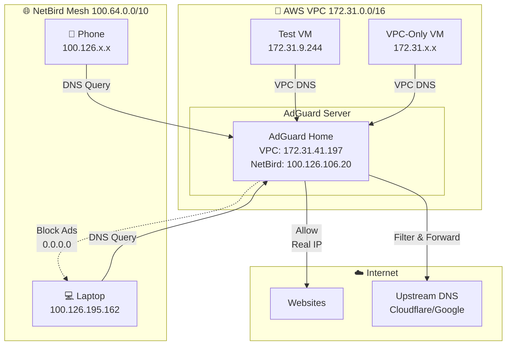
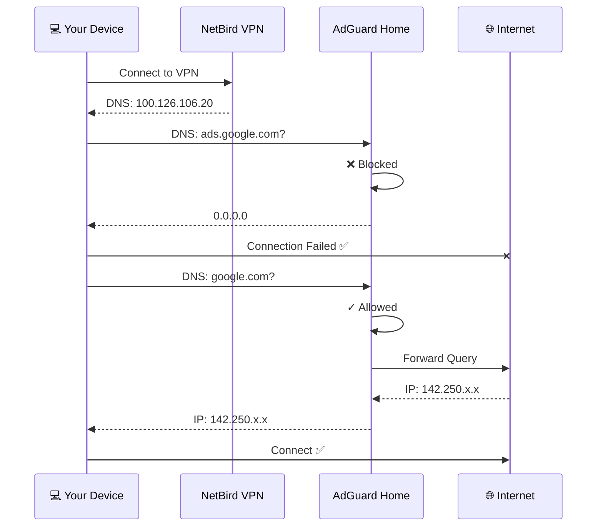
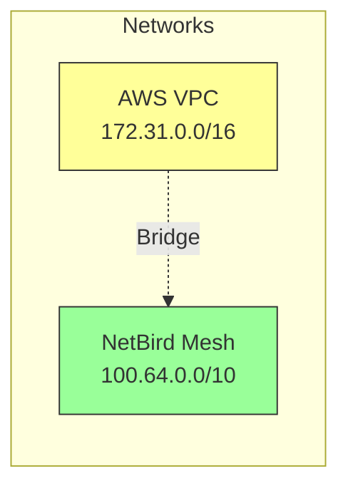
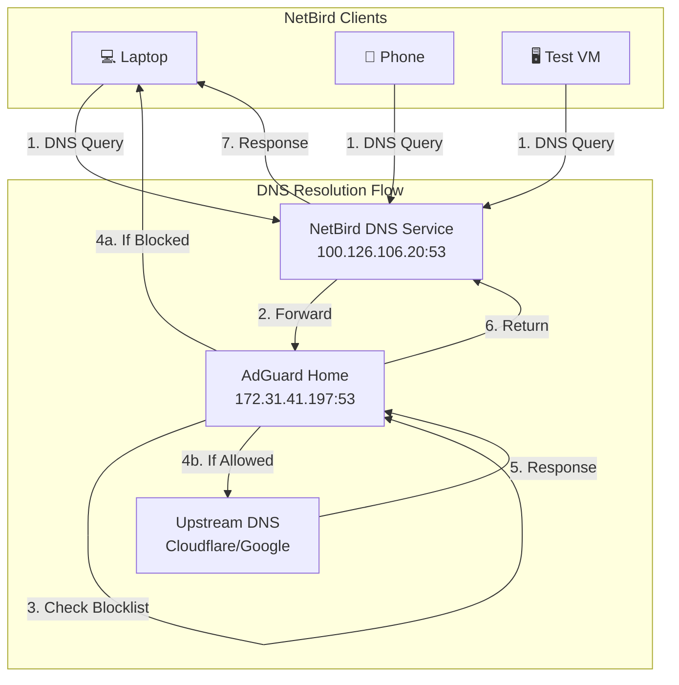

# AdGuard Home + NetBird Integration Tutorial

Network-wide ad blocking with secure remote access via VPN mesh network.

---

## Table of Contents

1. [Architecture Overview](#architecture-overview)
2. [Prerequisites](#prerequisites)
3. [AWS Infrastructure Setup](#aws-infrastructure-setup)
4. [NetBird Installation](#netbird-installation)
5. [AdGuard Home Deployment](#adguard-home-deployment)
6. [DNS Integration](#dns-integration)
7. [Testing & Verification](#testing--verification)
8. [Common Issues](#common-issues)

---

## Architecture Overview

### What You're Building



### How It Works



**Key Benefits:**
- 🚫 Network-wide ad blocking across all devices
- 🔒 Encrypted VPN mesh network
- 🌍 Works anywhere (home, office, mobile)
- 📊 Centralized DNS management
- ⚡ Faster page loads, less tracking

> 📚 **Want deeper technical details?** See [AdGuard + NetBird Deep Dive](../reference/adguard_netbird_deep_dive.md)

---

## Prerequisites

### Required Resources

| Component | Requirement |
|-----------|-------------|
| **AWS Account** | EC2 access, VPC permissions |
| **EC2 Instances** | 2-3 Ubuntu 24.04 VMs<br/>- 1× AdGuard (t3.small)<br/>- 1-2× Test VMs (t3.micro) |
| **NetBird Account** | Free tier available at [netbird.io](https://netbird.io) |
| **Devices** | Laptop, phone, or other clients to connect |

### Network Planning



**IP Ranges:**
- **VPC CIDR:** `172.31.0.0/16` (AWS internal)
- **NetBird CIDR:** `100.64.0.0/10` (VPN mesh)
- **DNS Port:** `53` (UDP/TCP)
- **AdGuard UI:** `8080` (TCP)

---

## AWS Infrastructure Setup

### Step 1: Launch EC2 Instances

**On AWS Console:**

1. Navigate to **EC2 Dashboard** → **Launch Instance**
2. Configure each instance:

| Setting | Value |
|---------|-------|
| AMI | Ubuntu Server 24.04 LTS |
| Instance Type | t3.small (AdGuard)<br/>t3.micro (others) |
| VPC | Default or custom VPC |
| Subnet | Any subnet in VPC |
| Auto-assign Public IP | ✅ Enable |
| Storage | 20 GB gp3 |
| Key Pair | Select existing or create new |

3. Launch **3 instances**:
   - `adguard-server` (t3.small)
   - `test-vm-1` (t3.micro)
   - `test-vm-2` (t3.micro)

### Step 2: Configure Security Group

**Create security group:** `adguard-netbird-sg`

**Inbound Rules:**

| Type | Protocol | Port | Source | Purpose |
|------|----------|------|--------|---------|
| SSH | TCP | 22 | Your IP/32 | SSH access |
| Custom TCP | TCP | 8080 | 172.31.0.0/16 | AdGuard UI (VPC) |
| Custom TCP | TCP | 8080 | 100.64.0.0/10 | AdGuard UI (NetBird) |
| DNS (TCP) | TCP | 53 | 172.31.0.0/16 | DNS from VPC |
| DNS (UDP) | UDP | 53 | 172.31.0.0/16 | DNS from VPC |
| Custom TCP | TCP | 53 | 100.64.0.0/10 | DNS from NetBird |
| Custom UDP | UDP | 53 | 100.64.0.0/10 | DNS from NetBird |
| WireGuard | UDP | 51820 | 0.0.0.0/0 | NetBird VPN |

**Apply to all instances.**

### Step 3: Initial Server Setup

SSH into **each instance** and run:

```bash
# Update system
sudo apt update && sudo apt upgrade -y

# Install essential tools
sudo apt install -y curl wget git vim net-tools dnsutils

# Configure firewall
sudo ufw allow ssh
sudo ufw allow from 172.31.0.0/16 to any port 53
sudo ufw allow from 100.64.0.0/10 to any port 53
sudo ufw allow from 172.31.0.0/16 to any port 8080
sudo ufw allow from 100.64.0.0/10 to any port 8080
sudo ufw allow 51820/udp
sudo ufw --force enable

# Verify
sudo ufw status numbered
```

**Expected output:**
```
Status: active

To                         Action      From
--                         ------      ----
22/tcp                     ALLOW IN    Anywhere
53                         ALLOW IN    172.31.0.0/16
53                         ALLOW IN    100.64.0.0/10
8080                       ALLOW IN    172.31.0.0/16
51820/udp                  ALLOW IN    Anywhere
```

---

## NetBird Installation

### Step 1: Install NetBird

**On ALL EC2 instances**, run:

```bash
# Download and install
curl -fsSL https://pkgs.netbird.io/install.sh | sh

# Verify installation
netbird version
```

**Expected output:**
```
NetBird version X.Y.Z
```

### Step 2: Connect to NetBird Network

**On each instance:**

```bash
# Start NetBird
sudo netbird up
```

**You'll see:**
```
Please use the following URL to authenticate:
https://app.netbird.io/peers?setup-key=XXXXXXXX

Waiting for authentication...
```

**Actions:**
1. Copy the URL
2. Open in your browser
3. Login to NetBird dashboard
4. Approve the device
5. Give it a descriptive name:
   - `adguard-aws` (for AdGuard server)
   - `test-vm-1` (for test VM 1)
   - `test-vm-2` (for test VM 2)

### Step 3: Verify Connectivity

**On each instance:**

```bash
# Check NetBird status
netbird status

# Note the NetBird IP
hostname -I
```

**Expected output:**
```bash
# netbird status
Management: Connected
Signal: Connected
NetBird IP: 100.126.106.20  # ← Note this!
Relays: 1 available
Peers: 2 connected

# hostname -I
172.31.41.197 100.126.106.20  # VPC IP, NetBird IP
```

**Test peer connectivity:**

```bash
# From test-vm-1, ping adguard server's NetBird IP
ping -c 3 100.126.106.20
```

**Expected:** ✅ Replies received

> 💡 **Tip:** Note down each server's NetBird IP. You'll need the AdGuard server's NetBird IP later.

---

## AdGuard Home Deployment

### Step 1: Install Docker

**On `adguard-server` only:**

```bash
# Install Docker
curl -fsSL https://get.docker.com -o get-docker.sh
sudo sh get-docker.sh

# Add user to docker group
sudo usermod -aG docker $USER

# Install Docker Compose
sudo apt install -y docker-compose-plugin

# Verify
docker --version
docker compose version

# Log out and back in for group changes to take effect
exit
```

**SSH back into `adguard-server`.**

### Step 2: Create AdGuard Directory

```bash
# Create directory structure
mkdir -p ~/adguard/{work,conf}
cd ~/adguard
```

### Step 3: Create Docker Compose File

```bash
cat > docker-compose.yml << 'EOF'
services:
  adguardhome:
    image: adguard/adguardhome:latest
    container_name: adguardhome
    restart: unless-stopped
    network_mode: host
    volumes:
      - ./work:/opt/adguardhome/work
      - ./conf:/opt/adguardhome/conf
    cap_add:
      - NET_ADMIN
    environment:
      - TZ=UTC
EOF
```

> **Why `network_mode: host`?**
> - Allows AdGuard to bind to all network interfaces (VPC, NetBird, localhost)
> - Simplifies DNS port (53) management
> - Required for multi-interface DNS listening

### Step 4: Start AdGuard

```bash
# Start AdGuard
docker compose up -d

# Check status
docker compose ps

# View logs
docker compose logs -f
```

**Expected output:**
```
✅ Container adguardhome  Started
```

**Press Ctrl+C to exit logs.**

### Step 5: Initial AdGuard Setup

**Get your AdGuard server's VPC IP:**

```bash
hostname -I | awk '{print $1}'
```

**Example output:** `172.31.41.197`

**From your local machine** (browser):

1. **If connected via NetBird:**
   ```
   http://100.126.106.20:3000
   ```

2. **If in same VPC (e.g., from test-vm-1):**
   ```bash
   # On test-vm-1
   curl http://172.31.41.197:3000
   # Or use SSH tunnel:
   # ssh -L 3000:172.31.41.197:3000 ubuntu@<test-vm-1-public-ip>
   ```

**Setup Wizard Steps:**

| Step | Configuration |
|------|---------------|
| **1. Welcome** | Click "Get Started" |
| **2. Admin Interface** | Listen: All interfaces<br/>Port: `8080` |
| **3. DNS Server** | Listen: All interfaces<br/>Port: `53` |
| **4. Admin Account** | Username: `admin`<br/>Password: (create strong password) |
| **5. Devices** | Skip (click Next) |
| **6. Finish** | Click "Open Dashboard" |

**You'll be redirected to:** `http://<your-ip>:8080`

### Step 6: Configure AdGuard Settings

**Login with your credentials.**

#### 6.1: Verify DNS Bind Configuration

Go to **Settings** → **DNS settings** → **DNS server configuration**

**Verify bind addresses:**

```bash
# Stop AdGuard temporarily
cd ~/adguard
docker compose down

# Check configuration
cat conf/AdGuardHome.yaml | grep -A 5 "bind_hosts"
```

**Should show:**
```yaml
dns:
  bind_hosts:
    - 0.0.0.0
  port: 53
```

**If not present, edit:**

```bash
nano conf/AdGuardHome.yaml
```

**Add/modify:**
```yaml
dns:
  bind_hosts:
    - 0.0.0.0
  port: 53
```

**Save (Ctrl+O, Enter, Ctrl+X) and restart:**

```bash
docker compose up -d
```

**Verify listening:**

```bash
# Check AdGuard is listening on port 53
sudo ss -tulnp | grep :53
```

**Expected:**
```
udp   LISTEN 0.0.0.0:53      *:*    users:(("AdGuardHome",pid=...))
tcp   LISTEN 0.0.0.0:53      *:*    users:(("AdGuardHome",pid=...))
```

#### 6.2: Configure Upstream DNS

**In AdGuard UI:**

Go to **Settings** → **DNS settings** → **Upstream DNS servers**

**Replace with:**
```
https://dns.cloudflare.com/dns-query
https://dns.google/dns-query
1.1.1.1
8.8.8.8
```

**Settings:**
- **Upstream mode:** Parallel (uses fastest)
- **Bootstrap DNS:** `1.1.1.1, 8.8.8.8`

**Click "Test upstreams"** → Should show all green ✅

**Click "Apply"**

#### 6.3: Enable Blocklists

Go to **Filters** → **DNS blocklists**

**Enable these lists:**
- ✅ AdGuard DNS filter
- ✅ AdAway Default Blocklist
- ✅ Steven Black's Unified hosts

**Add more (optional):**
- Click **Add blocklist** → **Choose from list**
- Select: OISD Blocklist Big, Peter Lowe's List

**Click "Update filters"**

#### 6.4: General Settings

**Settings** → **General settings:**
- ✅ Query logging: Enable (2160 hours)
- Statistics: 24 hours
- Blocking mode: Default

**Settings** → **DNS settings:**
- DNSSEC: Optional (can leave disabled)
- Blocking mode: Default
- DNS cache size: `4194304` (4MB)

**Click "Save"**

### Step 7: Test AdGuard Locally

**On `adguard-server`:**

```bash
# Test normal domain resolution
dig @127.0.0.1 google.com

# Test ad blocking (should return 0.0.0.0 or blocked)
dig @127.0.0.1 doubleclick.net

# Test via VPC IP
dig @172.31.41.197 github.com

# Test via NetBird IP
dig @100.126.106.20 microsoft.com
```

**Expected results:**
```bash
# google.com → Real IP (e.g., 142.250.x.x) ✅
# doubleclick.net → 0.0.0.0 ✅
# github.com → Real IP ✅
# microsoft.com → Real IP ✅
```

---

## DNS Integration

### Network Architecture



### Step 1: Configure NetBird DNS

**Login to NetBird Dashboard** (web interface):

1. Navigate to **DNS** → **Nameservers**
2. Click **Add Nameserver**
3. Configure:

| Field | Value |
|-------|-------|
| **Name** | AdGuard DNS |
| **Description** | Network-wide ad blocking |
| **Nameserver** | `172.31.41.197` (your AdGuard VPC IP) |
| **Port** | `53` |
| **Type** | UDP |

4. **Match Domains:** Select **All** (wildcard `*`)
5. **Distribution Groups:** Select **All**
6. **Enable** the toggle
7. Click **Save**

### Step 2: Add Network Route (Optional)

**To access VPC resources from NetBird clients:**

**In NetBird Dashboard** → **Network Routes**:

1. Click **Add Route**
2. Configure:

| Field | Value |
|-------|-------|
| **Network ID** | `aws-vpc` |
| **Description** | Access AWS VPC network |
| **Network** | `172.31.0.0/16` |
| **Routing Peer** | `adguard-aws` (your AdGuard server) |
| **Distribution Groups** | All |
| **Masquerade** | ✅ Enable |
| **Metric** | `9999` |

3. **Enable** and **Save**

### Step 3: Configure DNS on Clients

#### Linux Client (Ubuntu/Debian)

**After connecting to NetBird:**

```bash
# Connect to NetBird
sudo netbird up

# Configure DNS for NetBird interface
sudo resolvectl dns wt0 100.126.106.20
sudo resolvectl domain wt0 '~.'

# Verify
resolvectl status wt0
```

**Make permanent:**

```bash
sudo mkdir -p /etc/systemd/resolved.conf.d/
sudo tee /etc/systemd/resolved.conf.d/netbird-dns.conf << 'EOF'
[Resolve]
DNS=100.126.106.20
Domains=~.
EOF

sudo systemctl restart systemd-resolved
```

#### macOS Client

```bash
# Install NetBird
brew install netbirdio/tap/netbird

# Connect
sudo netbird up
```

**DNS configures automatically.** Verify in:
**System Settings** → **Network** → **NetBird (wt0)** → **DNS**

#### Windows Client

1. Download NetBird from [netbird.io/download](https://netbird.io/download)
2. Install and run
3. Click **Connect**
4. DNS auto-configures

**Verify:** Settings → Network & Internet → Change adapter options → NetBird → Properties → IPv4 → DNS

#### Android/iOS

1. Install **NetBird** app from App Store/Play Store
2. Connect to your network
3. DNS auto-configures

**Verify:** Test ad blocking by visiting `http://ads.google.com` in browser

#### VPC-Only VMs (Not using NetBird)

**For VMs that only use VPC IP:**

```bash
sudo nano /etc/systemd/resolved.conf
```

**Add:**
```ini
[Resolve]
DNS=172.31.41.197
FallbackDNS=1.1.1.1 8.8.8.8
```

**Restart:**
```bash
sudo systemctl restart systemd-resolved
resolvectl status
```

---

## Testing & Verification

### Test Suite

#### Test 1: DNS Resolution

**On any NetBird client:**

```bash
# Test normal resolution
dig google.com +short
nslookup github.com
```

**Expected:** Real IP addresses ✅

#### Test 2: Ad Blocking

```bash
# Known ad domains (should be blocked)
dig doubleclick.net +short
# Expected: 0.0.0.0 or no response

dig ads.google.com +short
# Expected: 0.0.0.0

dig googleadservices.com +short
# Expected: 0.0.0.0
```

#### Test 3: Query Logging

1. **Open AdGuard Dashboard:** `http://172.31.41.197:8080` (or NetBird IP)
2. Go to **Query Log**
3. **From a client, run:**
   ```bash
   dig test-query-$(date +%s).example.com
   ```
4. **Refresh Query Log**
5. **Verify:** Your query appears with client IP ✅

#### Test 4: Browser Test

**On a NetBird-connected device:**

1. Open browser (Chrome/Firefox)
2. Visit ad-heavy sites:
   - https://www.speedtest.net
   - https://www.cnn.com
   - https://www.forbes.com
3. **Observe:**
   - Fewer/no ads ✅
   - Faster page loads ✅
   - Some ad placeholders blank ✅
4. **Check AdGuard Query Log:**
   - Many blocked requests (red) ✅

### Automated Test Script

**Save as `test_adguard.sh`:**

```bash
#!/bin/bash

echo "=========================================="
echo "AdGuard + NetBird Integration Test"
echo "=========================================="
echo ""

echo "1. NetBird Status"
echo "------------------"
netbird status | grep -E "Management|NetBird IP"
echo ""

echo "2. DNS Server Check"
echo "-------------------"
cat /etc/resolv.conf | grep nameserver
echo ""

echo "3. Normal DNS Resolution"
echo "------------------------"
echo "google.com:"
dig google.com +short | head -1
echo ""

echo "4. Ad Blocking Test"
echo "-------------------"
echo "doubleclick.net (should be 0.0.0.0):"
dig doubleclick.net +short
echo ""

echo "5. Performance Test"
echo "-------------------"
time dig google.com > /dev/null 2>&1
echo ""

echo "=========================================="
if dig doubleclick.net +short | grep -q "0.0.0.0"; then
    echo "✅ SUCCESS! Ad blocking working!"
else
    echo "❌ ISSUE: Ads not blocked"
    echo "Run: resolvectl status wt0"
fi
echo "=========================================="
```

**Run:**

```bash
chmod +x test_adguard.sh
./test_adguard.sh
```

### Dashboard Metrics

**Access:** `http://172.31.41.197:8080`

**Key Metrics:**
- 📊 Total queries processed
- 🚫 Queries blocked (%)
- 👥 Top clients
- 🔴 Top blocked domains
- 📈 Query timeline

---

## Common Issues

### Issue 1: Ads Not Being Blocked

**Symptoms:**
```bash
dig doubleclick.net +short
# Returns: 142.251.x.x (real IP) ❌
```

**Diagnosis:**

```bash
# Check DNS server being used
dig doubleclick.net | grep SERVER
```

**Solutions:**

**1. Client not using NetBird DNS:**

```bash
sudo resolvectl dns wt0 100.126.106.20
sudo resolvectl domain wt0 '~.'
```

**2. AdGuard filters not enabled:**
- Go to AdGuard → **Filters**
- Enable blocklists
- Click **Update filters**

**3. Test direct query:**

```bash
dig @100.126.106.20 doubleclick.net +short
# Should return 0.0.0.0
```

### Issue 2: DNS Resolution Fails

**Symptoms:**
```bash
dig google.com
# connection timed out; no servers could be reached
```

**Solutions:**

**1. Check AdGuard is running:**

```bash
# On AdGuard server
docker compose ps
# Should show "Up"

# If not running:
docker compose up -d
```

**2. Check connectivity to AdGuard:**

```bash
ping -c 3 100.126.106.20
nc -zvu 100.126.106.20 53
```

**3. Check firewall:**

```bash
# On AdGuard server
sudo ufw status | grep 53
# Should allow port 53
```

### Issue 3: Can't Access AdGuard UI

**Symptoms:** Browser timeout on `http://172.31.41.197:8080`

**Solutions:**

**1. Use correct IP:**
- ✅ VPC IP: `http://172.31.41.197:8080`
- ✅ NetBird IP: `http://100.126.106.20:8080`
- ❌ Public IP may be blocked

**2. Check firewall:**

```bash
sudo ufw allow from 172.31.0.0/16 to any port 8080
sudo ufw allow from 100.64.0.0/10 to any port 8080
```

**3. Add NetBird route to VPC** (if not already):
- NetBird Dashboard → **Network Routes** → Add route to `172.31.0.0/16`

### Issue 4: NetBird Shows "0/1 Nameservers"

**Symptoms:**
```bash
netbird status
# Nameservers: 0/1 Available
```

**This is a known display issue.** Verify DNS actually works:

```bash
dig @100.126.106.20 google.com
# If this works, integration is fine ✅
```

---

## Maintenance

### Weekly Tasks

**Update blocklists:**
- AdGuard Dashboard → **Filters** → **Update filters**

### Monthly Tasks

```bash
# Update AdGuard
cd ~/adguard
docker compose pull
docker compose up -d

# Backup configuration
sudo tar -czf adguard-backup-$(date +%Y%m%d).tar.gz conf/
```

### Performance Monitoring

**Dashboard:** `http://172.31.41.197:8080`

**Expected Metrics:**
- Query response time: < 50ms
- Block rate: 10-30% (typical)
- Cache hit rate: 60-80%

---

## Next Steps

🎯 **You now have:**
- ✅ Network-wide ad blocking
- ✅ Secure VPN mesh network
- ✅ Centralized DNS management
- ✅ Privacy-focused DNS filtering

**Enhancements:**
- Add more devices (phones, IoT)
- Create custom filtering rules
- Set up DNS rewrites for internal services
- Configure split DNS for custom domains
- Add more blocklists

**Resources:**
- 📚 [AdGuard + NetBird Deep Dive](../reference/adguard_netbird_deep_dive.md)
- 🌐 [NetBird Documentation](https://docs.netbird.io)
- 📖 [AdGuard Home Official Docs](https://github.com/AdguardTeam/AdGuardHome/wiki)

---

🎉 **Enjoy your ad-free network!**
